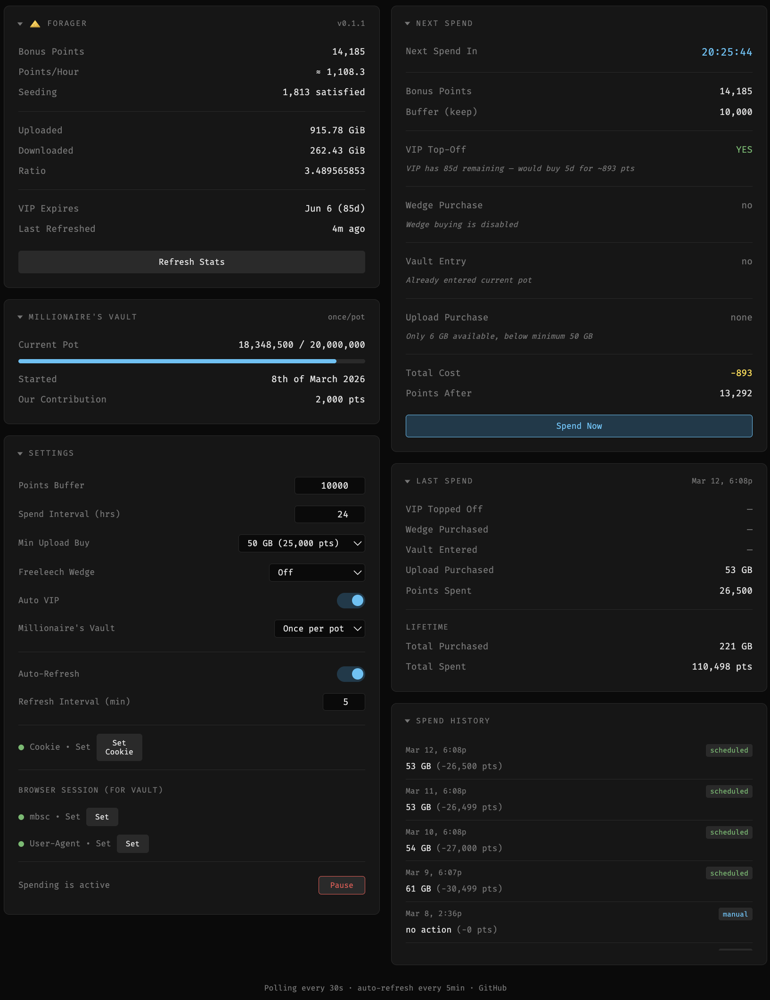

#  Forager

Automatic bonus point spender for [MyAnonamouse](https://www.myanonamouse.net). Runs as a lightweight Docker container (~15 MB) with a web dashboard for configuration and monitoring.

Forager converts idle bonus points into upload credit on a schedule, keeping your ratio healthy without manual intervention. It can also maintain VIP membership, buy Freeleech Wedges, and contribute to the Millionaire's Vault.

<p align="center">
  
</p>

## Features

- **Upload Credit** — Buy upload in bulk (500 pts/GB, 50 GB minimum per purchase)
- **VIP Top-Off** — Automatically extend VIP to the 90-day cap when it drops below threshold
- **Freeleech Wedges** — Buy wedges at 50,000 pts each (before upload, or wedge-only mode)
- **Millionaire's Vault** — Donate 2,000 pts per pot (once per pot or daily)
- **Spend Preview** — Next Spend card shows a live simulation based on current stats and settings
- **Spend History** — Rolling 90-day log of all purchases
- **Points/Hour** — Live stats scraped from your profile page
- **Pause/Resume** — Temporarily halt scheduled spending
- **Auto-Refresh** — Configurable refresh interval (default 5 min) fetches live stats from MAM
- **Dark UI** — Single-page dashboard with collapsible cards

## Quick Start

```yaml
# docker-compose.yml
services:
  forager:
    build: ./forager
    container_name: forager
    environment:
      - TZ=America/Los_Angeles
    env_file:
      - ./forager/settings.env
    ports:
      - "127.0.0.1:5011:5011"
    volumes:
      - ./forager:/srv/forager
    restart: always
    healthcheck:
      test: ["CMD-SHELL", "curl -fs http://localhost:5011/health || exit 1"]
      interval: 30s
      timeout: 10s
      retries: 3
```

```bash
docker-compose up -d forager
```

Open `http://localhost:5011` and paste your `mam_id` cookie to get started.

## Getting Your Cookie

1. Log in to MAM in your browser
2. Go to **Settings** → **Security** → scroll to **mam_id**
3. Copy the value and paste it into the Forager UI under **Cookie**

That's all you need for core functionality (upload credit, VIP, wedges).

### Browser Session (for Vault)

Vault donations require a browser session cookie (`mbsc`) and User-Agent string because the vault pages don't support the JSON API.

1. Open MAM in Chrome and navigate to any page
2. Open DevTools → **Application** → **Cookies** → `myanonamouse.net`
3. Copy the `mbsc` cookie value
4. Copy your browser's User-Agent string (DevTools → Console → `navigator.userAgent`)
5. Paste both into the Forager UI under **Browser Session**

The session is self-sustaining — Forager captures the rotated cookie from each response and keeps the session alive with periodic page loads every 4 hours.

## Configuration

All runtime settings are managed through the web UI and stored in `state.json`. No container restart needed.

### Settings

| Setting | Default | Description |
|---------|---------|-------------|
| Points Buffer | 10,000 | Points to keep in reserve (never spent) |
| Spend Interval | 24 hrs | Time between scheduled spend cycles |
| Auto VIP | On | Top off VIP when it drops below the 90-day cap |
| Min Upload Buy | 50 GB | Minimum upload purchase per cycle (50 or 100 GB) |
| Freeleech Wedge | Off | `off` / `before` upload / `only` (wedges only, no upload) |
| Millionaire's Vault | Off | `off` / `once` per pot / `daily` |

### Environment Variables

Set in `settings.env`:

| Variable | Default | Description |
|----------|---------|-------------|
| `FORAGER_USER` | _(none)_ | Basic auth username (optional) |
| `FORAGER_PASS` | _(none)_ | Basic auth password (optional) |
| `FORAGER_PORT` | `5011` | HTTP listen port |
| `TZ` | `UTC` | Timezone for timestamps and logging |

## How It Works

### Spend Cycle

Each cycle (scheduled or manual) runs this sequence:

1. **Fetch profile** from MAM API — current points, VIP expiry, upload/download stats
2. **VIP top-off** — if enabled and VIP is more than 1 day below the 90-day cap, buy days to reach the cap (~178.57 pts/day)
3. **Wedge purchase** — if enabled and points exceed buffer + 50,000
4. **Vault donation** — if enabled, browser session is active, and contribution conditions are met (once per pot or daily)
5. **Upload purchase** — spend remaining points above buffer on upload credit (single purchase, 50 GB minimum)
6. **Verify** — re-fetch profile to confirm purchases succeeded
7. **Record** — save spend details to history and update lifetime totals

### Points Economy

| Item | Cost | Notes |
|------|------|-------|
| 1 GB upload | 500 pts | Minimum 50 GB per purchase |
| VIP (4 weeks) | 5,000 pts | Pro-rated; `duration=max` buys to 90-day cap |
| Freeleech Wedge | 50,000 pts | One wedge per purchase |
| Vault donation | 2,000 pts | Max 2,000 per day |

### Session Management

Forager uses two separate authentication mechanisms:

- **`mam_id` cookie** — for the JSON API (`/jsonLoad.php`, `/json/bonusBuy.php`). Used for all point spending and profile queries. Obtained from MAM account settings.
- **`mbsc` cookie** — for HTML pages (vault, profile page). Rotates on every request. Required only for vault features and points/hour stats.

## API

All endpoints return JSON with CORS headers.

| Method | Path | Description |
|--------|------|-------------|
| `GET` | `/health` | `{"ok": true, "version": "0.1.1"}` |
| `GET` | `/state` | Full state with profile, settings, vault, history |
| `PUT` | `/state` | Update cookie, settings, browser session, or pause state |
| `POST` | `/refresh` | Fetch fresh stats from MAM (no spending) |
| `POST` | `/dry-spend` | Simulate a spend cycle |
| `POST` | `/spend` | Execute a real spend cycle |
| `GET` | `/history` | Spend history (last 90 days) |

## Architecture

```
forager/
├── Dockerfile              Alpine 3.21 + curl + jq + lighttpd
├── VERSION                 Semantic version string
├── settings.env            Environment variables (auth, port)
├── app/
│   ├── entrypoint.sh       Process supervisor (lighttpd + spender)
│   ├── lib.sh              Shared library (MAM API, state, spending logic)
│   ├── spender.sh          Background daemon (scheduled spends + session keepalive)
│   └── test.sh             Test suite (shunit2)
└── www/
    ├── index.html           Single-page dashboard (vanilla JS)
    └── cgi-bin/             CGI endpoints (shell scripts via lighttpd)
```

- **No dependencies** beyond Alpine base packages (`curl`, `jq`, `lighttpd`)
- **No build step** — shell scripts and vanilla JS
- **Single container** — lighttpd serves both the SPA and CGI endpoints
- **State on disk** — `state.json` persists via volume mount at `/srv/forager`

## Running Tests

```bash
docker exec forager sh /app/test.sh
```

Tests cover state management, locking, timestamp formatting, and API endpoints (unit tests run against a separate lighttpd instance on a different port).

## License

MIT
